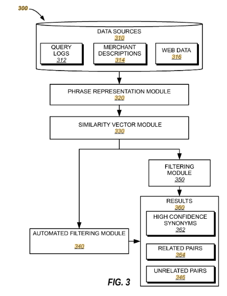

## Search and Ranking Systems

Staff Engineer @ BloomReach — Oct 2013 to Mar 2018  
**Location:** Bengaluru, India

**Overview**  
Led the design and implementation of an **automated synonym generation** pipeline for BloomReach Discovery, processing **100 million+ product descriptions** and **30 million+ queries** weekly to extract high-quality synonym pairs for e-commerce search.
As deep learning started emerging, designed deep NNs to match user queries with document text & images.

**Key Features**  
- **Data Mining & Representation:**  
  - Extract candidate phrase pairs from product catalog text, Web crawl, and search logs.  
  - Build contextual embeddings via co-occurrence contexts, click-through distributions, document-vector averages, and session proximity.
- **Similarity Metrics & Filtering:**  
  - Combine symmetric (JS divergence) and asymmetric (hyponym/hypernym) measures, augmented by edit-distance heuristics.  
  - Apply phrase-specific thresholds (e.g. ensuring D(P, Q) < D(P, P′) where P′ is a known variant) to filter high-confidence pairs.  
  - Train a supervised classifier on multi-score feature vectors to rank and grade synonyms.  
- **Continuous Learning:** Weekly batch updates to capture evolving language, new trends, and seasonal shifts in user queries.

**Patents**
  - [US20180060936A1: Search Ranking System](https://patents.google.com/patent/US20180060936A1)  
  - [US20160350395A1: Synonym Generation](https://patents.google.com/patent/US20160350395A1)

**Resources**  
- Blog: [Synonym Generation](https://dev.to/bloomreach/discovery-synonym-generation-at-bloomreach-ob5)
