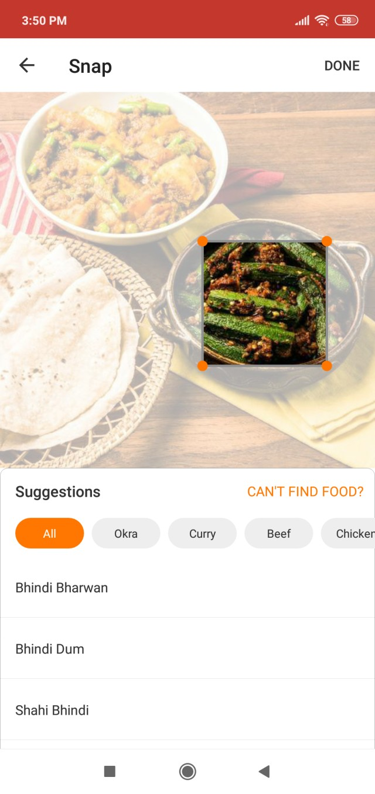

### Indian Food Recognition & Automated Logging

**Machine Learning Lead** @ HealthifyMe  — May 2018 to Jul 2019  

**Overview**  
Faced with high dropout rates due to manual food logging, we built India’s first AI-powered “snap‐and‐log” system, proving feasibility to our CEO/CTO in less than 2 weeks. Over 1 million Indian‐food images were collected to train a bespoke deep‐learning classifier, achieving > 83 % accuracy on diverse regional dishes. Thousands of users now log meals via a single tap.

{: width="50%" }

**Work**  
- **Rapid Prototype (2 weeks):**  
  - Curated an initial dataset of 5 K+ home‐cooked dishes.  
  - Trained a lightweight CNN from scratch; deployed behind a simple Flask API and basic web UI.  
- **Scale & Accuracy:**  
  - Expanded to a **1 million–image Indian Food Dataset** covering 1 500+ dish classes.  
  - Optimized model for < 100 ms inference on CPU; integrated quantization and pruning.  
- **Production Deployment:**  
  - Built a production service for real‐time image upload, inference, and calorie estimation.  
  - Instrumented analytics to track usage and guide iterative improvements.

**Impact**
- **User Engagement:** Snap‐and‐log feature increased meal‐logging retention by 60 %.  
- **Business Value:** Convinced leadership to spin out a dedicated Computer Vision team.

**Resources**  
- Press: [How HealthifyMe’s Ria 2.0 AI Assistant Improves Diet Tracking](https://indianexpress.com/article/technology/social/healthifyme-wants-to-improve-your-diet-with-its-ria2-0-ai-assistant-here-is-how-5544698/)
