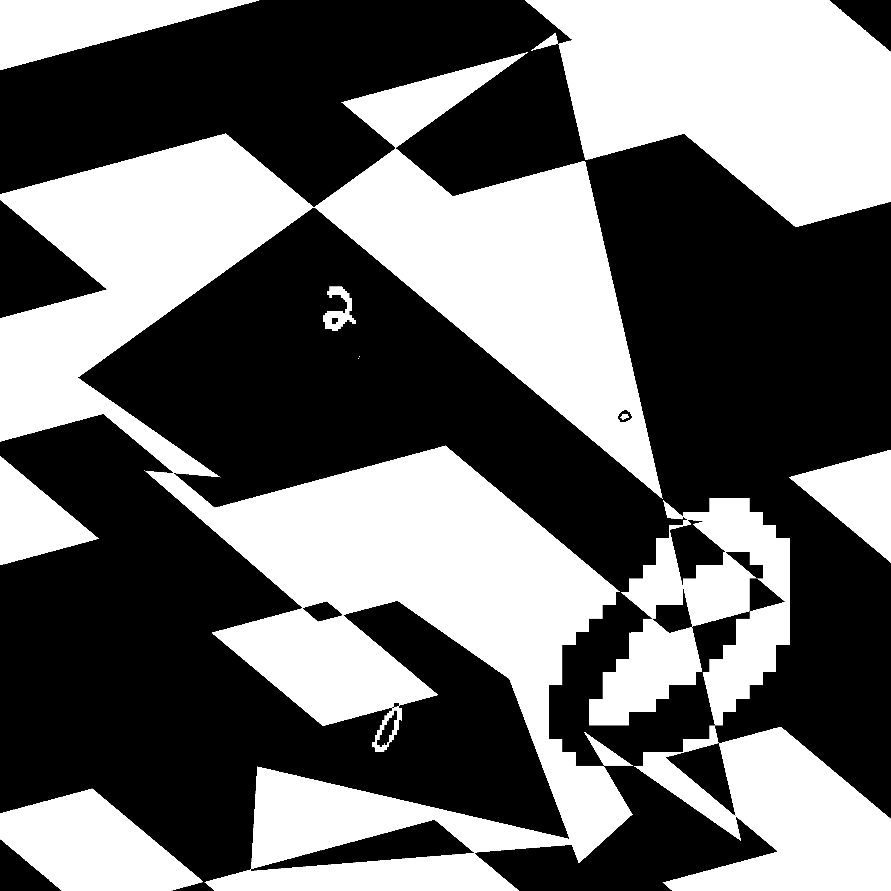

## Rank 1 @ Kaggle UltraMNIST 

Independent Project — Kaggle UltraMNIST Competition (Date)

**Overview**  
Secured **1st place** on the Kaggle UltraMNIST challenge with **99.109%** test accuracy. Combined a small-object detector (YOLOv5s) and a high-accuracy classifier (EfficientNetV2-B1) on a custom synthetic dataset to handle 2560×2560 images containing up to five tiny objects.
{: width="50%" }

**Key Components**  
- **Synthetic Data Generation**  
  - Created checkerboards with boxes, circles, triangles. Used solvers to determine placement of digits so that they dont overlap. 
  - Applied perspective, rotation, zoom, and uniform digit placement (all 70 000 MNIST digits + empty images).  
- **Detection (YOLOv5s)**  
  - Input: 2560×2560; augmentation: light rotate/scale/translate/HSV/mosaic.  
  - Config: `conf_threshold=0.1`, `iou_threshold=0.1`, class-agnostic NMS, `max_det=5`.  
  - Recall > 95%.  
- **Classification (EfficientNetV2-B1)**  
  - Input: 128×128 crops (aspect-ratio normalized).  
  - Pretrained on ImageNet; light aug (shift/scale, perspective, invert, blur, HSV).  
  - Training: 200 epochs, LR schedule [3e-4 → 1e-5], TTA (invert images).  
  - Accuracy > 98%.  
- **Post-Processing**  
  - Removed nested detections and low-confidence (< 0.45) preds.  
  - Final ensemble accuracy: **99.109%**.

**Resources**  
- Code & Models: [github.com/4g/umnist](https://github.com/4g/umnist)  
- Competition: [UltraMNIST on Kaggle](https://www.kaggle.com/competitions/ultra-mnist/leaderboard)  
- Writeup : [Kaggle writeup](https://www.kaggle.com/competitions/ultra-mnist/discussion/319145)