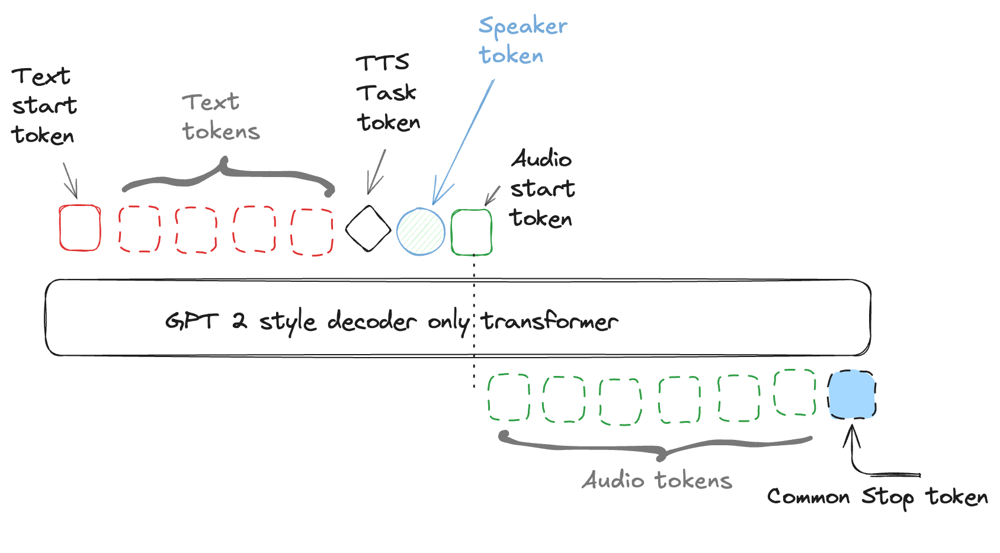

## Indri: Ultralight Audio Model

**Overview**  
Indri is a novel, ultra-small transformer-based TTS/ASR model that treats audio as discrete tokens. It supports both Hindi and English, and delivers high-quality, style-consistent speech synthesis and recognition—all in a 124 M-parameter footprint.

**Links & Resources**  
- Blog post: [Building Indri TTS](https://www.indrivoice.ai/blog/2024-11-21-building-indri-tts)
- Model & demos: [11mlabs/indri-0.1-124m-tts on Hugging Face](https://huggingface.co/11mlabs/indri-0.1-124m-tts)  
- Code & self-hosted service: [github.com/indri-voice/indri](https://github.com/indri-voice/indri)

**Key Features**  
- **Tiny & Fast:** Just 124 M parameters (GPT-2 small backbone) yet achieves realtime on CPU and up to 10× realtime on consumer GPUs (e.g. RTX6000 Ada: 400 tokens/s, <20 ms to first token).  
- **Streaming & Voice-Cloning:** Autoregressive audio-token decoding with streaming output; supports speaker style prompts (<5 s) for consistent voice cloning.  
- **Bilingual & Code-Mixing:** Natively handles English, Hindi, and mixed-language inputs.  
- **End-to-End Pipeline:**  
  1. Text → text-tokens  
  2. GPT-2 LM → audio-tokens  
  3. Mimi decoder → waveform
- **Novel architecture** combining transformers with audio tokens, bringing text and audio to same space.

**Audio Samples**  
- **Sample 1:** मित्रों, हम आज एक नया छोटा और शक्तिशाली मॉडल…  
  <audio controls src="https://huggingface.co/11mlabs/indri-0.1-124m-tts/resolve/main/data/cebed668-62cb-4188-a2e1-3af8e017d3ba.wav"></audio>  
- **Sample 2:** भाइयों और बहनों, ये हमारा सौभाग्य है कि…  
  <audio controls src="https://huggingface.co/11mlabs/indri-0.1-124m-tts/resolve/main/data/6e0a4879-0379-4166-a52c-03220a3f2922.wav"></audio>  
- **Sample 3:** Hello दोस्तों, future of speech technology mein…  
  <audio controls src="https://huggingface.co/11mlabs/indri-0.1-124m-tts/resolve/main/data/5848b722-efe3-4e1f-a15e-5e7d431cd475.wav"></audio>  
- **Sample 4:** In this model zoo, a new model called Indri…  
  <audio controls src="https://huggingface.co/11mlabs/indri-0.1-124m-tts/resolve/main/data/7ac0df93-edbd-47b2-b850-fb88e329998c.wav"></audio>