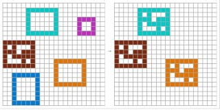
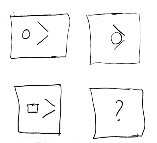

# Small World Setup

Imagine a 2D grid world with only boxes of multiple colors. Physics in this world is exactly as you’d expect. Can an LLM learn to operate in this world? Can it reason through images like these?

 

> We can edit these worlds mentally with ease. We can manipulate boxes and solve problems in our mind. Our mind searches for solutions to problems in this world, even though we have never seen this world before.

- **Search over solutions**: very fast simulation or intrinsic search?
- **Verification** on regions by zooming and selecting

---

## Solving This in the Current Learning Paradigm

1. The model needs to intrinsically understand this world and its basic operations.
2. It should grasp what “add” and “subtract” mean in this tiny universe.
3. It must be able to:
   - Solve tasks in this environment
   - Learn new scenarios, as long as they stay within this world

---

## Three Experiments Enabled by This Setup

1. **Reasoning** about a small world  
2. **Learning** a world model and using it in a reasoning chain  
3. **Teaching** the world to a model without wrecking past learning (e.g., by building world models in context)

---

## Creating These Worlds

1. Each world has **organisms**—just connected shapes.  
2. We take real-life “behaviours” such as:
   - Copy  
   - Reverse  
   - Hole filling  
   - Symmetry  
   - Repetitions  
   - “Big eats small” (size)  
   - Shape-dependent properties  
   
   …and generate **millions** of small worlds.

---

## Notes on Representation

- **Tokens** are edits in small worlds.  
  - E.g., rather than using raw image frames (where a simple leg movement is costly to encode), use a starting state + an “edit” to capture that movement.  
  - This is a promising way to represent videos.
- **Questions**:
  - Do existing video tokenizers already capture this?
  - Does DINO-WM do it?
  - Are edits embeddings, or can they be discrete tokens?

---

## Next Data Frontier

Models left “in the wild” learning from their own actions and feedback.  
- **Can** we teach a model to learn autonomously in such an environment?

---

## Proposed Architecture

1. **Build** a small world  
2. **Train** an architecture that interacts with it  
   - If the world is similar to ARC-2, the model should solve ARC tasks.  
3. **Mixture of Experts**:  
   - One expert triggers **only** on visual input  
4. **Language** as the most efficient communication channel between agents in an environment  
5. **Evolutionary** mechanism: many instances interact, poorly performing ones get “eliminated”

---

## Development Steps

1. Get the stack ready for small-world setup  
2. Train a small language model  
3. Train a small visual‐language model  
4. Perform reward‐based training  
5. Write a simulator for ARC-like problems (copying, falling, etc.)  
6. Attach a pre-trained small language model to the simulator and collect data  
7. Devise training so the model retains and prioritizes important information  
8. Measure accuracy **before** and **after** training

---

## Possible Environment Builders

- [Habitat-Lab (Facebook Research)](https://github.com/facebookresearch/habitat-lab)  
- Mujoco

---

## Readables on World Models

- [ICLR 2025 Accepted Papers on World Models](https://sites.google.com/view/worldmodel-iclr2025/accepted-papers)  
- [ICLR 2025 Workshop: World Models on OpenReview](https://openreview.net/group?id=ICLR.cc/2025/Workshop/World_Models#tab-accept)  
- [WorldModels Project](https://worldmodels.github.io/)  
- [Huyen’s Multimodal Overview](https://huyenchip.com/2023/10/10/multimodal.html?utm_source=chatgpt.com#lm_objective)  
- [ArXiv: 2408.11039v1](https://arxiv.org/html/2408.11039v1#bib)
