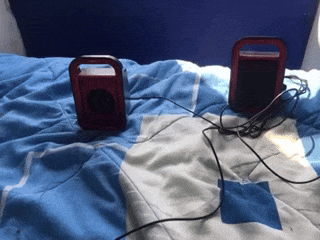
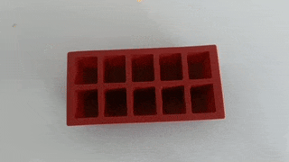

# Do visual cues help vlms ? 

## Problem
VLMs are very good at identifying events in videos. But it is hard to focus their attention on a specific action or object, specially if the object or action is a small part of the video. Humans use visual cues to attract attention towards a region or action, e.g. a stop sign on the road or a wiggly line drawn under wrongly spelled text. Once focused we can observe finegrained details from that region. This experiment is to determine if using visual cues like bboxes/trajectories will help VLMs focus better.

TLDR : Not really. Adding cues confuses models.  

 

## Experiment
### Training
A ~9.5k video subset of ssv2 dataset which has 50 verbs and ~4000 objects. 

```python
>> random.sample(verbs, 5)
>> ['picking', 'dropping', 'throwing', 'poking', 'twisting']

>> random.sample(objects, 5)
>> ['a teaspoon', 'amrutanjan balm', 'teapoy', 'a pamphlet', 'salt container']
```

Create multiple choice questions for every video, to predict the object or verb 

|Video plain / cued| mcq |
|---|---|
|   | Q1. dropping _____ into red rubber ice-tray.  <br>Options: crumpled paper, a gift bag, thermos bottle, a cheese cube  <br>Answer: a cheese cube  <br><br> Q2. dropping a cheese cube into _____.  <br>Options: dettol bottle, salt shaker, stack plastic cups, red rubber ice-tray  <br>Answer: red rubber ice-tray  <br><br> Q3. _____ a cheese cube into red rubber ice-tray.  <br>Options: hitting, pulling, falling, dropping  <br>Answer: dropping |


#### Training sample
```json
{
   "question": "_____ plastic spoon down",
   "choices": [
    "moving",
    "tipping",
    "lifting",
    "folding"
   ],
   "answer": "moving",
   "video": "104789",
   "type": "verb"
  }
```

#### Setup
- We split the dataset into test:train::1:8.5 
- Each video has average of 2.5 questions
- ~42k training samples, 2.5k test samples for cued and 2.5k for plain
- We train a single model with both plain and cued videos
    - base = qwenvl3 2b/4b instruct
    - bs = 8, grad acc = 4, 1 epoch = ~1.3k steps
    - lora `(rank=64, alpha=64)` over llm only
    - cosine lr with peak 1e-4, and warmup of 3%
- vllm for inference with guided response choices 

### Results
Before finetuning, object accuracy is lower for cued videos. 

| model                      | videos      | object_acc | verb_acc | overall_acc |
|---------------------------|-------------|-----------:|---------:|------------:|
| pretrained | plain       | 90.77%     | 63.90%   | 79.39%      |
| pretrained | trajectory  | 85.74%     | 64.40%   | 76.29%      |


After finetuning, cued videos perform worse in both object and verb category. 

| model                      | videos      | object_acc | verb_acc | overall_acc |
|---------------------------|-------------|-----------:|---------:|------------:|
| finetuned                  | plain       | 96.40%     | 98.30%   | 97.29%      |
| finetuned                  | trajectory  | 93.77%     | 98.00%   | 95.65%      |


## Interpretation
### Attention maps
What happens to attention when we add these boxes and trajectory lines ? Intuitively, results should be much better because there is a clear indicator of region which will fetch correct answer. But something else happens.  

We debug this in multiple ways by checking attention of vit, llm and measuring perplexity of different types of images. 

- **Attention disrupted** : visual cues attract attention away from natural visual features [attach map]

- **VLMs have fragmented attention**: VLMs are a combination of a clip based embedder and an llm. In this exercise we finetune only the language part. [show clip attention map, and compare with llm attentions]

- **Model bias**: pretrained models that have not see many trajectories or bounding boxes, dont interpret these as natural features and get confused. [high activations on bbox boundaries, not inside]

- **Cues are a different language** from natural visual features. They require understanding abstractions. e.g. a black triangle on road implies slope ahead. [add examples of perplexity of a visual cues being much higher than a normal image] 


**This indicates that**
- instead of reinforcing relevant regions, trajectory overlays can diffuse or misplace the model’s focus.
- simply adding cues in few examples is not enough and more work is needed to make cues work for vlms. 

## Reproduce
Follow instructions at : https://github.com/4g/visual_cues.git
