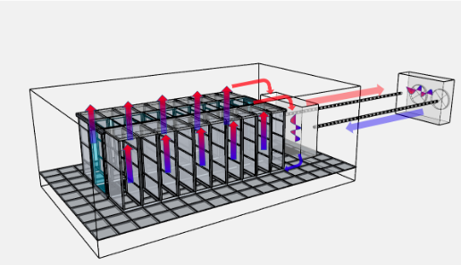

# Using Machine Learning to Efficiently Cool Data Centers

> 30–40% of power costs in a data center go to cooling. This README describes a data-driven methodology to model, simulate, and automatically optimize cooling policies to reduce PUE while honoring operational constraints.

[Github Repo](https://github.com/4g/dcool/)

## Table of Contents

* [Problem Statement](#problem-statement)
* [Introduction](#introduction)
* [Background](#background)
* [Our Methodology](#our-methodology)

  * [Using data to model and then control](#using-data-to-model-and-then-control)

    * [Modelling](#modelling)
    * [Model as proxy](#model-as-proxy)
    * [Model testing](#model-testing)
    * [Generating policies](#generating-policies)
* [Experiments](#experiments)

  * [Strategy Simulations](#strategy-simulations)

    * [What does the model learn?](#what-does-the-model-learn)
  * [EnergyPlus Simulations](#energyplus-simulations)
* [Integration with DCIM](#integration-with-dcim)
* [Launch](#launch)
* [Data Required for Modelling](#data-required-for-modelling)

## Problem Statement

30–40% of power costs in a data center go to cooling. Average PUE of data centers in India is over **1.7**. Though data centers have state-of-the-art cooling systems from leading vendors, they can be managed more efficiently due to:

1. **Hard-to-model environments:** There’s no safe place to experiment with new settings (e.g., setpoints).
2. **Coarse, localized policies:** Often tuned for peak IT load and ignore cross-system interactions.
3. **Reactive/static control:** E.g., lowering AC temperature only after a zone heats up.

## Introduction

Past sensor and control data can be used to model data centers. These models can accurately predict the impact of changing setpoints and can be used to test or even auto-generate new policies.

## Background

Google successfully deployed machine-learning-based cooling control in their data centers, reportedly saving **~40%** of cooling energy and achieving very low PUE (≈ **1.06**). See:

* [Google Sustainability](https://sustainability.google/projects/machine-learning/)
* [DeepMind on reducing data center energy use](https://blog.google/topics/environment/deepmind-ai-reduces-energy-used-for/)

---

## Our Methodology

### Using data to model and then control

#### Modelling

* Most DC equipment (via **Modbus/SNMP**) feeds data to DCIM or similar systems (e.g., rack temps, IT load, AHU fan speeds).
* We train deep neural networks on this time-series data to learn a function mapping **setpoints + sensor readings → cooling power usage**.
* Objective: **accurate aggregate prediction of energy usage in the next 1 hour**.

#### Model as proxy

* Direct experimentation is risky.
* The trained model acts as a **virtual testbed** to estimate PUE impacts of changes (e.g., +1 °C PAC setpoint) **without touching production**.

#### Model testing

* Deployed in a **containerized** environment (cloud or on-prem).
* DC personnel can safely **experiment with policies** using the model. This is a **risk-free** stage.

#### Generating policies

* We use **reinforcement learning (RL)** to derive control strategies for specific scenarios.
* The RL agent is **rewarded** for reducing PUE while respecting constraints.
* Generated policies are pushed to **DCIM** for **review or direct deployment**.

## Experiments

### Strategy Simulations

Consider **4 racks** in a cold-aisle/hot-aisle layout. Each rack intakes from the cold aisle and exhausts to the hot aisle.

* Floor tiles are controllable, with a tile temperature setpoint of **0.1** (10% of max allowable).
* All racks start at **0.9** (90% of max allowable).
* The model is trained for a day to bring rack temperatures down to **0.8**, minimizing **time** and **energy**.

#### What does the model learn?

* **After 10,000 iterations** ([video](http://storage.googleapis.com/solveforx/dccool/simvideos/10000iters.mp4)):

  1. Cools some servers in **Rack 2**.
  2. Leverages cool air in the middle hot aisle to cool **Rack 3**.
  3. Chooses some **suboptimal tiles** and keeps them on.
* **After 20,000 iterations** ():

  1. Learns to **switch tiles on/off**.
  2. Optimizes **tile damping**.

### EnergyPlus Simulations

We use **EnergyPlus** to simulate building energy consumption and override its control system:

* Build digital twins of existing DCs.
* Generate sensor/control data for training and architecture design.
* Acts as a **safe experimentation platform**.

*Simulated DC floor*

## Integration with DCIM

* Runs in cloud, on a DC workstation, or **as a DCIM plugin**.
* Requires API access to DCIM data (or a portal for periodic data uploads).

## Launch

> *Before launch, we collect operational constraints (e.g., temperature at rack < 22 °C). All policies enforce constraints at all times.*

* **Stage 1 – Assisted generation (slow):**
  Generate policies **every 6 hours**, reviewed by SMEs, deployed via DCIM, continuously monitored.
* **Stage 2 – Faster assisted:**
  Generate policies **~hourly**; still **manual approval** required.
* **Stage 3 – Auto-deploy with daily verification:**
  If ≥ **99%** pass in Stage 2, move to **automatic DCIM deployment**; **daily policy verification** and continuous monitoring.
* **Stage 4 – Full autonomy with fallback:**
  System takes control; team retains **revert** capability for events.
* **Performance monitoring:**
  Track all systems/constraints and **quantify energy savings**.

## Data Required for Modelling

> The list below is illustrative. **Missing or extra parameters do not materially affect savings potential.**

**Sensory data**

* Rack temperature & humidity (**necessary**)
* Outside air temperature & humidity (**necessary**, can be sourced externally if not logged)

**Cooling system data**

* **AHUs**

  * Setpoint
  * Return air temperature
  * Supply air temperature
  * Fan speed
  * Power consumption
* **Chillers / Condensers / Cooling towers / loops**

  * Inlet & outlet temperatures
  * Fan/drive speeds
  * Power consumption
  * Other state variables

**Overall metrics**

* **PUE**
* **IT load**
* Power distribution across AHUs, chillers, cooling towers, etc.
