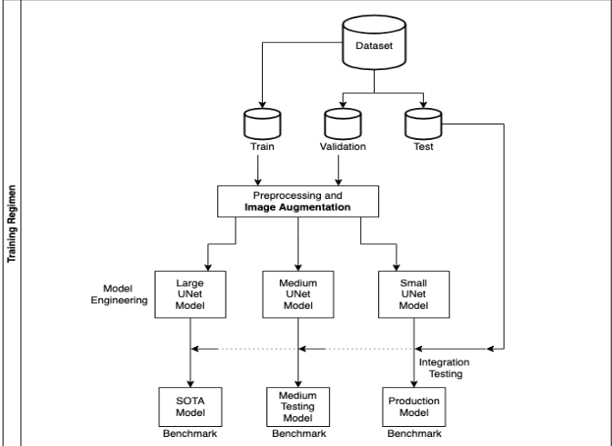

## Pose Estimation on the Edge: Real-time Workout Feedback

**Machine Learning Lead** @ cult.fit — Jul 2020 to Dec 2021

**Overview**  
Built an on-device pose-estimation pipeline using TensorFlow Lite to power interactive workouts with real-time rep-counting, energy scoring, and form feedback without any server round-trips.

**Model & Deployment**  
- **Architecture:** CenterNet-inspired U-Net with MobileNet backbone, predicting 30 keypoint heatmaps (256×256 → 64×64).  
- **Variants:**  
  - **SMALL:** 1.27 M params, 58.6 FPS on laptop CPU  
  - **MEDIUM:** 2.45 M params, 29.8 FPS  
  - **LARGE:** 3.79 M params, 5.8 FPS 
  - **Edge Optimizations:** Mixed-precision training, data caching, and TFLite integration for sub-20 ms/frame inference on mobile CPUs.

**Robustness & Accuracy**  
- **Augmentations:** Random occlusion, brightness/contrast shifts, 90° rotations, horizontal flips.  
- **Inference Enhancements:**  
  - **Dynamic Cropping:** Uses last-frame keypoints to crop noisy inputs.  
  - **Low-Pass Filter:** Smooths high-frequency jitter for stable joint tracking.

**Applications**  
- **Rep Counting:** Rule-based state machine on keypoints, deployed in the cult.fit app and gym-mirror prototype.  
- **Energy Meter:** Velocity-based scoring displayed live in UI to gamify workouts.

**Links & Resources** 
- Demo Video [cult rep counting]
<video controls autoplay muted loop width="640">
  <source src="{{ '/assets/cult_small.mp4' | relative_url }}" type="video/mp4">
  Your browser doesn’t support HTML5 video.</video>

- Training regimen : 
